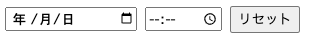

# React-Datetime-Input



## Overview

`DateTimeInput` コンポーネントは、日付と時間の入力を処理するための React コンポーネントです。ユーザーが日付と時間を選択できるユーザーフレンドリーなインターフェースを提供し、選択された DateTime 値を親コンポーネントに返します。このコンポーネントは、イベントスケジューリング、リマインダー、または日付と時間情報が必要な任意のフォームにとって有用です。

## Features

- **簡単な統合**: 任意の React アプリケーションに簡単に統合できます。
- **カスタマイズ可能なスタイリング**: 簡単なスタイリングのためにカスタムクラス名とインラインスタイルをサポートします。
- **リセット機能**: 選択された日付と時間をクリアするリセットボタンを含みます。
- **エラーハンドリング**: 無効な日付入力に対するエラーフィードバックを提供します。
- **エポックミリ秒での初期化**: 日付と時間フィールドを事前に設定するために、エポックミリ秒の初期値を受け入れます。

## Usage

```jsx
import React, { useState } from "react";
import DateTimeInput from "./DateTimeInput";

function App() {
  const [dateTimeValue, setDateTimeValue] = useState({
    date: null,
    error: null,
  });

  const handleChange = (value) => {
    setDateTimeValue(value);
  };

  return (
    <div className="app">
      <DateTimeInput onChange={handleChange} />
    </div>
  );
}

export default App;
```

## Props

| プロパティ         | 型                  | デフォルト        | 説明                                                       |
| ------------------ | ------------------- | ----------------- | ---------------------------------------------------------- |
| `onChange`         | 関数                | 必須              | 選択された日付と時間、またはエラーを返すコールバック関数。 |
| `initialValue`     | 数値                | undefined         | エポックミリ秒での初期日時値。                             |
| `wrapperClassName` | 文字列              | "date-time-input" | ラッパーdivのカスタムクラス名。                            |
| `wrapperStyles`    | React.CSSProperties | {}                | ラッパーdivのインラインスタイル。                          |
